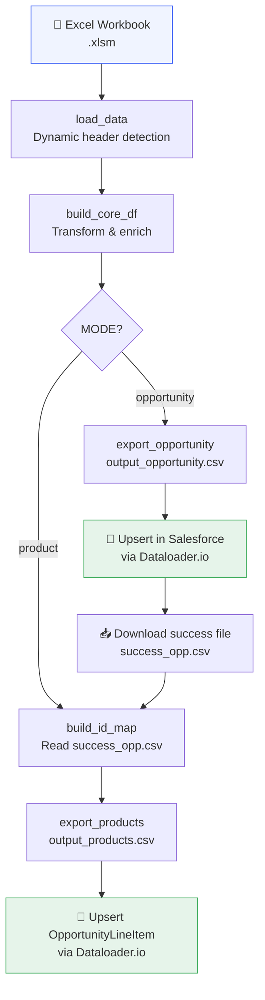
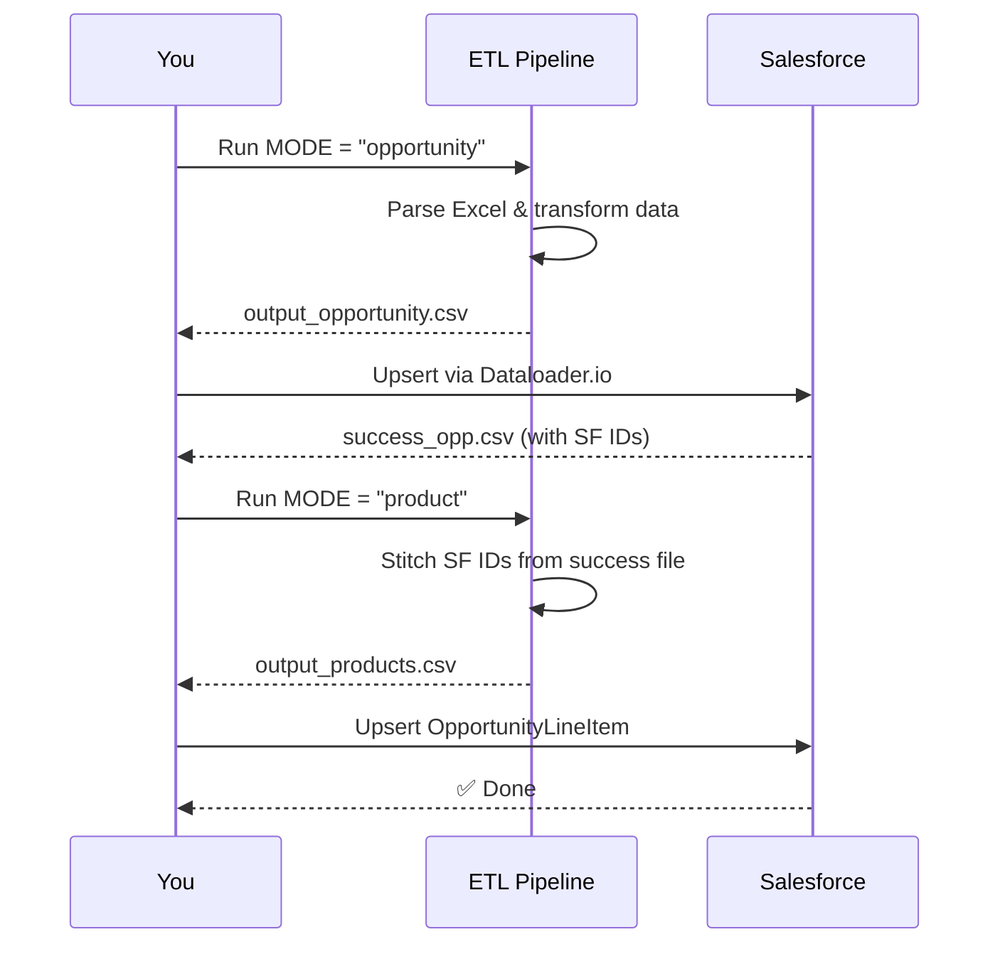
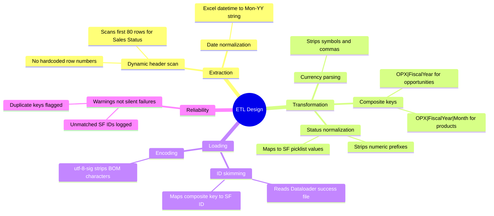

# 📊 Salesforce Sales Forecast ETL Pipeline

> A Python ETL pipeline that transforms Excel sales forecasts into Salesforce-ready CSVs — automating data sync and eliminating 15+ hours of manual work per upload cycle.


---

## 📌 Overview

Sales forecast data lives in a structured Excel workbook maintained by the sales team. Manually copying this into Salesforce was taking **15+ hours per upload cycle**.

This pipeline automates the entire process:

- **Extracts** data from a multi-sheet `.xlsm` workbook with dynamic header detection
- **Transforms** raw data — normalizing statuses, resolving account names, generating composite keys, and computing transaction dates
- **Loads** two structured CSVs ready for Salesforce bulk upsert

---

## 🔄 Pipeline Architecture



---

## 🗂️ Workflow



---

## ⚙️ Setup

### Prerequisites

```bash
pip install pandas openpyxl
```

> Python 3.10+ required

### Salesforce (One-Time)

Add two custom External ID fields before first use:

| Object | Field API Name | Type | Options |
|---|---|---|---|
| Opportunity | `OPX_Composite_Key__c` | Text(80) | ✅ External ID, ✅ Unique |
| OpportunityLineItem | `OPX_Product_Key__c` | Text(100) | ✅ External ID, ✅ Unique |

---

## 🛠️ Configuration

Edit the `CONFIGURATION` block at the top of `etl.py`:

```python
MODE        = "opportunity"        # "opportunity" or "product"
FILE        = Path("SALES-FORECAST.xlsm")
SHEET       = "2026"
FISCAL_YEAR = 2026

# Map Excel short names → Salesforce Account names
ACCOUNT_MAP = {
    "ACME":   "Acme Corporation",
    "GLOBEX": "Globex Industries",
}

# Map Excel short names → Salesforce user full names
USER_MAP = {
    "Alice": "Alice Johnson",
    "Bob":   "Bob Smith",
}
```

---

## 🚀 Usage

### Step 1 — Export Opportunities

```bash
# Set MODE = "opportunity" in etl.py
python etl.py
```

Upload `output_opportunity.csv` to Salesforce via Dataloader.io using `OPX_Composite_Key__c` as the External ID.

### Step 2 — Export Products

Download the Dataloader.io success file → save as `success_opp.csv`, then:

```bash
# Set MODE = "product" in etl.py
python etl.py
```

---

## 📤 Output Format

### `output_opportunity.csv`

| Column | Description |
|---|---|
| `OPX_Composite_Key__c` | Upsert key: `OPX-1234\|2026` |
| `Account_Name` | Resolved Salesforce account name |
| `Customer Project` | Opportunity name (Customer + Project) |
| `Sales Status` | Normalized Salesforce stage name |
| `Closed Date` | Jan 1 or Dec 31 based on OPX suffix |
| `Transaction Date` | Last day of month before first revenue |
| `Opportunity_Owner` | Resolved Salesforce user full name |

### `output_products.csv`

| Column | Description |
|---|---|
| `OPX_Product_Key__c` | Upsert key: `OPX-1234\|2026\|M06 Revenue` |
| `Opportunity_ID` | Salesforce ID (006...) from success file |
| `Product_Name` | e.g. `M06 Revenue` |
| `UnitPrice` | Revenue value for that month |
| `Transaction_Date` | First day of the revenue month |

---

## 🧠 Key Design Decisions



---

## 🛡️ Error Handling

| Scenario | Behaviour |
|---|---|
| `Sales Status` header not found | Exits with descriptive message |
| Success file missing | Exits before product stage |
| Unmatched Salesforce IDs | Logged as warnings, not silent failures |
| Duplicate composite keys | Flagged with full row output |
| Invalid currency values | Skipped via `pd.to_numeric(errors="coerce")` |

---

## 📁 Project Structure

```
salesforce-forecast-etl/
├── etl.py                  # Main pipeline script
├── SALES-FORECAST.xlsm     # Input workbook (not included)
├── success_opp.csv         # Dataloader success file (generated)
├── output_opportunity.csv  # Stage 1 output (generated)
├── output_products.csv     # Stage 2 output (generated)
└── README.md
```
